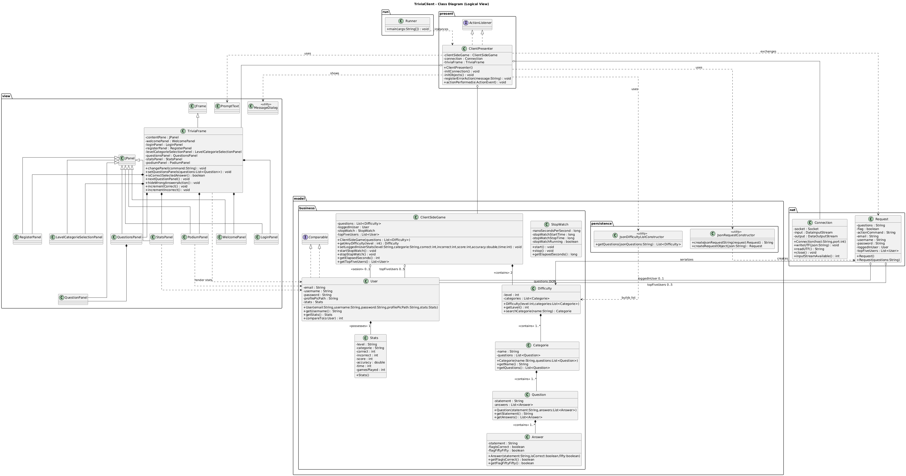
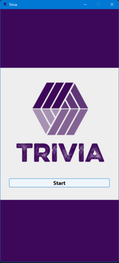
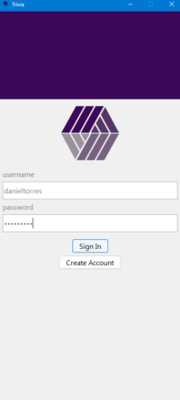
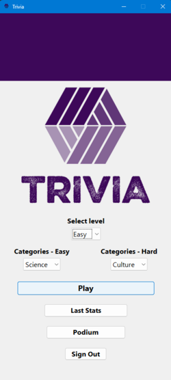
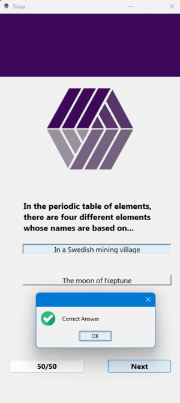
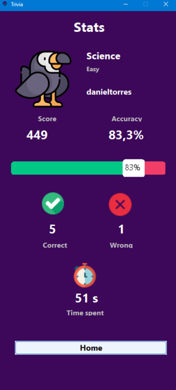
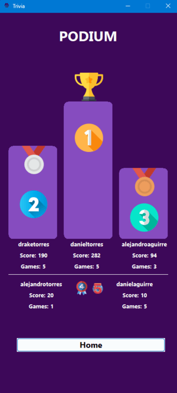

<h1 align="center">TriviaClient</h1>
<p align="center">
Client application (Swing) for a multi-user trivia game based on a client-server model.<br>
Manages authentication, game flow, statistics, leaderboard and communication with the server via JSON over sockets.
</p>

---

## Index
- [Index](#index)
- [Overview](#overview)
- [Key Features](#key-features)
- [Architecture and Design](#architecture-and-design)
- [UML Class Model](#uml-class-model)
- [Package Structure](#package-structure)
- [Execution Flow](#execution-flow)
- [Data Model](#data-model)
- [Communication Protocol](#communication-protocol)
- [State Management and Statistics](#state-management-and-statistics)
- [Dependencies](#dependencies)
- [Installation and Execution](#installation-and-execution)
  - [Command line (example)](#command-line-example)
- [Configuration](#configuration)
- [Resources (Assets)](#resources-assets)
- [Screenshots](#screenshots)
- [Best Practices and Coding Standards](#best-practices-and-coding-standards)
- [Extensibility](#extensibility)
- [Roadmap / Future Ideas](#roadmap--future-ideas)
- [Credits and Author](#credits-and-author)
- [License](#license)

---

## Overview
TriviaClient is the client side of a trivia system. It is responsible for:
* Displaying a smooth graphical interface (Swing) segmented into panels with navigation using `CardLayout`.
* Managing user session (registration, login, logout).
* Requesting / receiving data from the server (questions, user validations, leaderboard, statistics persistence) through a simple TCP channel (`Socket`) encapsulated by the `Connection` class.
* Building and deserializing JSON messages using Gson to transport commands and entities (`Request`).
* Calculating and presenting statistics (score, accuracy, time, match history) and ranking (top 5 players).

The project follows an approach close to MVP (Model–View–Presenter):
* `present.ClientPresenter` acts as the orchestrator (Presenter / GUI event controller + application layer).
* The `model` package contains domain entities and client logic (timer, construction of question structures, local statistics).
* The `view` package contains the Swing panels, decoupled from logic via `ActionCommand` and listeners.

## Key Features
- Registration and login with server-side validation.
- Level selection (Easy / Hard) and thematic category selection.
- Question engine with support for a "50/50" help.
- Score calculation dependent on correct answers and time penalty.
- Metrics: correct, incorrect, accuracy (%), time, games played.
- Leaderboard (Top 5) display with name, score and games played.
- Persistence of relevant state on the server (via `Request` objects).
- Compact interface (420x900) optimized for vertical screens / controlled density.

## Architecture and Design
| Layer | Responsibility | Key Components |
|------|-----------------|-------------------|
| Presentation | Navigation, event dispatch, transitions between panels | `ClientPresenter`, `TriviaFrame`, Swing panels |
| Domain / Client Logic | Local game model, timing, statistics calculation | `ClientSideGame`, `StopWatch`, `Stats` |
| Data / Serialization | JSON <-> Object conversion, construction of question lists | `JsonRequestConstructor`, `JsonDifficultyListConstructor` |
| Network | Simple binary transport, UTF send/receive over socket | `Connection` |

Patterns and decisions:
* `CardLayout` for navigation between views without reloading unnecessary state.
* Use of button `ActionCommand` to centralize flow in a single `actionPerformed` (reduces coupling between view and logic).
* Lazy construction of question panels (each `QuestionPanel` is instantiated when a block of questions is set).
* Division of questions by level -> `Difficulty` -> `Categorie` -> `Question` -> `Answer` (clear and scalable hierarchy).

## UML Class Model

[View diagram - Zoom in]([https://raw.githubusercontent.com/danieltorrez29/TriviaClient/refs/heads/master/resources/images/diagrams/trivia_client_class_diagram.png))



## Package Structure
```
co.edu.uptc.run        -> Entry point (Runner)
co.edu.uptc.present    -> Event orchestrator (ClientPresenter)
co.edu.uptc.view       -> Swing views (Welcome, Login, Register, Selection, Questions, Stats, Podium)
co.edu.uptc.net        -> Communication (Connection, Request)
co.edu.uptc.model.business    -> Entities and logic (User, Stats, Difficulty, Categorie, Question, Answer, StopWatch, ClientSideGame)
co.edu.uptc.model.persistence -> JSON serialization (JsonRequestConstructor, JsonDifficultyListConstructor)
resources/             -> Images and configuration (config.properties, graphic assets)
```

## Execution Flow
1. `Runner.main()` instantiates `ClientPresenter`.
2. `ClientPresenter` loads `config.properties` and opens the socket (`Connection`).
3. Waits for an initial response from the server with the questions (JSON) and builds the list of `Difficulty`.
4. Instantiates `TriviaFrame` and panels, initially showing `WelcomePanel`.
5. User logs in or registers (commands: `Sign In`, `Create Account - User`).
6. After login the user navigates to the selection panel (levels / categories) and then to questions (`Play`).
7. During the trivia:
     - Stopwatch (`StopWatch`) starts when `Play` is pressed.
     - `50/50` button invokes `hideWrongAnswersAction` hiding two answers marked as not fifty.
     - Each `Next` processes the answer and advances / finalizes.
8. Upon completion: score is calculated = `correct * 100 - elapsedSeconds` and accuracy = `correct / (correct + incorrect) * 100`.
9. An update is sent (`Request` with user and stats). Statistics are displayed in `StatsPanel`.
10. The user can view the Leaderboard (`Podium`) which triggers a request to obtain the top 5.

## Data Model
Relations:
* Difficulty (level:int) -> List<Categorie>
* Categorie (name) -> List<Question>
* Question (statement) -> List<Answer>
* Answer (statement, flagIsCorrect, flagFiftyFifty)
* User (email, username, password, profilePicPath, Stats)
* Stats (level, category, correct, incorrect, score, accuracy, time, gamesPlayed)

`Request` acts as a versatile container for:
* Commands (actionCommand)
* Validation flags (flag)
* Credentials / registration data
* Initial questions (questions JSON)
* Authenticated user (loggedInUser)
* Top 5 (`topFiveUsers`)

## Communication Protocol
Transport: TCP `Socket` + `DataInputStream/DataOutputStream` with `writeUTF/readUTF`.

Messaging (JSON via Gson):
```json
{
    "actionCommand": "Sign In",
    "username": "player1",
    "password": "secret",
    "flag": true,
    "loggedInUser": { ... },
    "questions": "[...]",
    "topFiveUsers": [ ... ]
}
```

Typical Sign In sequence:
1. Client sends a Request with `actionCommand=Sign In`, username/password.
2. Server responds with a Request containing `flag=true|false` and (on success) `loggedInUser` and possibly current stats.

Leaderboard:
* Client sends `actionCommand=Podium`.
* Server returns populated `topFiveUsers`.

Match completion:
* Client sends `actionCommand=Next` with the `loggedInUser` updated after the final calculation.

## State Management and Statistics
- Timing: `StopWatch` based on `System.nanoTime()`.
- Score and accuracy calculation centralized in `ClientPresenter` (at the end of questions) and set via `ClientSideGame.setLoggedInUserStats`.
- Number of matches incremented after each completed trivia.
- The client does not re-download questions during the session; they are kept in memory.

## Dependencies
- Java SE 17
- Gson 2.10 (`lib/gson-2.10.jar`)

## Installation and Execution
1. Ensure the server is running and reachable (HOST/PORT match `resources/properties/config.properties`).
2. Compile (if using `javac`) or run from your IDE.

### Command line (example)
```bash
cd TriviaClient
javac -cp .;lib/gson-2.10.jar src/co/edu/uptc/net/*.java src/co/edu/uptc/model/**/*.java src/co/edu/uptc/view/*.java src/co/edu/uptc/present/*.java src/co/edu/uptc/run/Runner.java -d bin
java -cp bin;lib/gson-2.10.jar co.edu.uptc.run.Runner
```
In PowerShell you may need: `-cp .;lib/gson-2.10.jar` (Windows). On Unix systems: `-cp .:lib/gson-2.10.jar`.

## Configuration
File: `resources/properties/config.properties`
```
HOST=127.0.0.1
PORT=5000
```
Modify according to the server location.

## Resources (Assets)
- The `resources/images` folder contains icons and graphics (logo, medals, animals, etc.).
- The frame loads `logo.png` as the window icon.
- Panels (Stats, Podium, Welcome) draw images manually using `Graphics` + `ImageIO.read`.

## Screenshots

Here are some representative screenshots of the application:

[](./resources/images/screenshots/welcome.png)
[](./resources/images/screenshots/login.png)
[](./resources/images/screenshots/home.png)
[](./resources/images/screenshots/game.png)
[](./resources/images/screenshots/stats.png)
[](./resources/images/screenshots/podium.png)

## Best Practices and Coding Standards
- Classes with uniform JavaDoc (Constructor, getters, descriptive methods).
- Strict encapsulation (private attributes + controlled getters/setters).
- Semantic naming of `ActionCommand` to avoid multiple listeners.
- Model / view separation (panels do not know networking details or global game logic).

## Extensibility
Direct extension ideas:
| Area | Improvement | Description |
|------|--------|-------------|
| Security | Password hashing | Avoid plain transmission and delegate hashing to the server. |
| Experience | Progress bar | Show progress between questions. |
| Game | New modes | Per-question timer, lives, streaks. |
| Internationalization | i18n | Extract strings to bundles. |
| Local persistence | Offline cache | Save last questions/answers if the server goes down. |
| UI | Modern Look & Feel | FlatLaf / light/dark theme. |

## Roadmap / Future Ideas
- Client-side email validation before sending.
- Reconnection mechanism if the socket is lost.
- Explicit error protocols (status codes in JSON).
- Additional metrics: average response speed, streaks.
- Subtle animations (transitions between panels) using `CardLayout` + effects.
- Unit tests (mocking `Connection`) and integration tests.

## Credits and Author
Author: [@danieltorrez29](https://github.com/danieltorrez29) – Systems and Computer Engineer - Database Specialist.

## License
This project is licensed under the MIT License - see the [LICENSE](LICENSE) file for details
